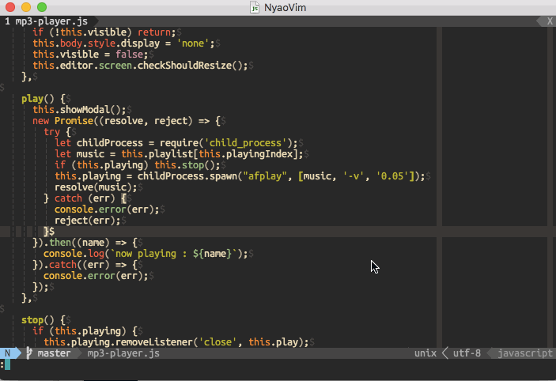

# music.nyaovim



## Installation

```
Plug 'MaxMellon/music.nyaovim'
```

## Usege

| commands | args | discription |
|---|---|---|
| :MP3PlayerInit | directroy path (optional) | Inialize PlayList |
| :MP3PlayerToggle | - | Toggle Player UI |
| :MP3PlayerOpen | - | Open Player UI |
| :MP3PlayerClose | - | Close Close UI |
| :MP3PlayerPlay | - | Play music `*.mp3` in PlayListDirectory |
| :MP3PlayerStop | - | Stop Music |
| :MP3PlayerNext | - | Next Music in PlayList |
| :MP3PlayerPrev | - | Prev Music in playList |

## Configuration

`~/.config/neovim/inint.vim`

```vim
let g:playlist_directory = "~/Music/MyList"

```

default play list directory : `${HOME}/Music`
Please copy mp3 file into playlist directory.


`~/.config/nayovim/nyaovimrc.html`

```html
<dom-module id="nyaovim-app">
  <template>
    <style>
.horizontal {
  display: flex;
  width: 100%;
  height: 100%;
}
    </style>
    <div class="horizontal">
      <mp3-player editor="[[editor]]"></mp3-player>
      <neovim-editor id="nyaovim-editor"
          argv$="[[argv]]"
          font-size="14"
          font="Ubuntu Mono,monospace"
          line-height="1.0"
      ></neovim-editor>
    </div>
  </template>
</dom-module>
```

## Dependency

  -  afplay >= 2.0.0

## LICENSE

  This software is released under the MIT License, see LICENSE.txt.
